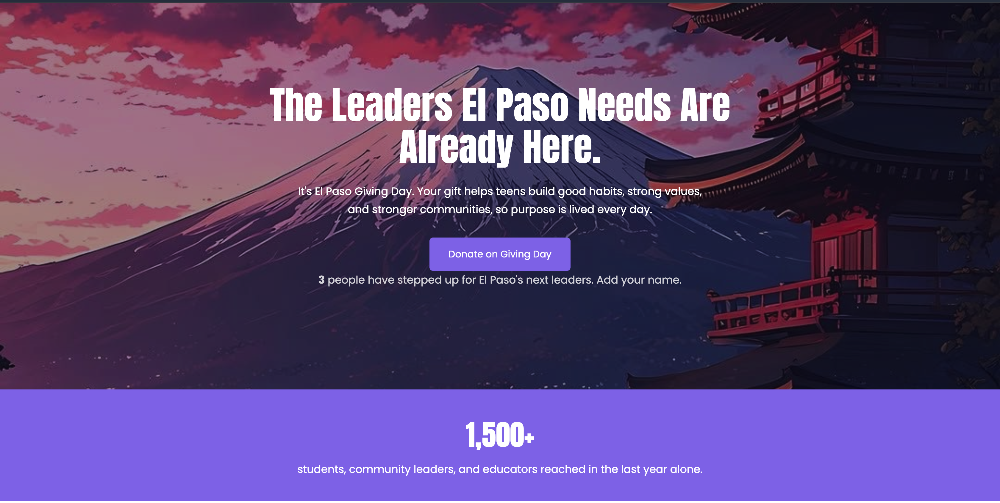

# Strive Now — El Paso Giving Day Landing Page

A responsive fundraising landing page created for **Strive Now**, an El Paso nonprofit focused on helping young people develop purpose, leadership, strong values, and positive habits.

I developed this project as part of my internship work with Element 7. The landing page was designed to support **El Paso Giving Day** by providing visitors with a clear way to learn about Strive Now's impact, donate, and sign up for information about the organization's Year 5 Gala.

## Project Overview

The goal of this project was to turn a provided design and set of functional requirements into a responsive, working web experience.

Key functionality includes:

- Responsive desktop and mobile layouts
- Rotating hero-image carousel with automatic transitions and pause-on-hover
- Centralized donation URL configuration
- Persistent donation click counter
- Serverless backend using Netlify Functions
- Persistent counter storage using Netlify Blobs
- VidLead email signup form integration
- Reduced-motion accessibility support
- Git and GitHub version control

## Technologies Used

- HTML5
- CSS3
- JavaScript
- Netlify Functions
- Netlify Blobs
- VidLead
- Git
- GitHub

## Project Preview

## Features

### Donation System

All donation buttons use a centralized donation URL, making it easy to update the campaign destination without changing every button individually.

### Persistent Donation Click Counter

The landing page tracks how many times visitors click a Donate button.

The counter uses a Netlify Function as the backend and Netlify Blobs for persistent storage. When a visitor clicks a Donate button:

1. The browser sends a POST request to the Netlify Function.
2. The function retrieves the current count.
3. The count is incremented and saved.
4. The updated count is returned to the webpage.
5. Future visitors see the stored count when the page loads.

The counter also animates when the page loads while respecting the user's reduced-motion preference.

### Hero Photo Rotator

The hero section automatically rotates through campaign photos every five seconds using JavaScript and CSS transitions.

The carousel:

- Loops continuously
- Uses smooth fade transitions
- Pauses when the user hovers over the hero
- Resumes when the pointer leaves
- Adapts image cropping for mobile displays
- Respects reduced-motion preferences

### VidLead Integration

The Gala signup section embeds Strive Now's VidLead form, allowing visitors to submit their email address for information about the organization's Year 5 Gala.

The embedded form was tested across desktop and mobile layouts.

### Responsive Design

The landing page was designed for both desktop and mobile devices. Responsive styling adjusts typography, content spacing, cards, hero imagery, calls to action, and form presentation for smaller screens.